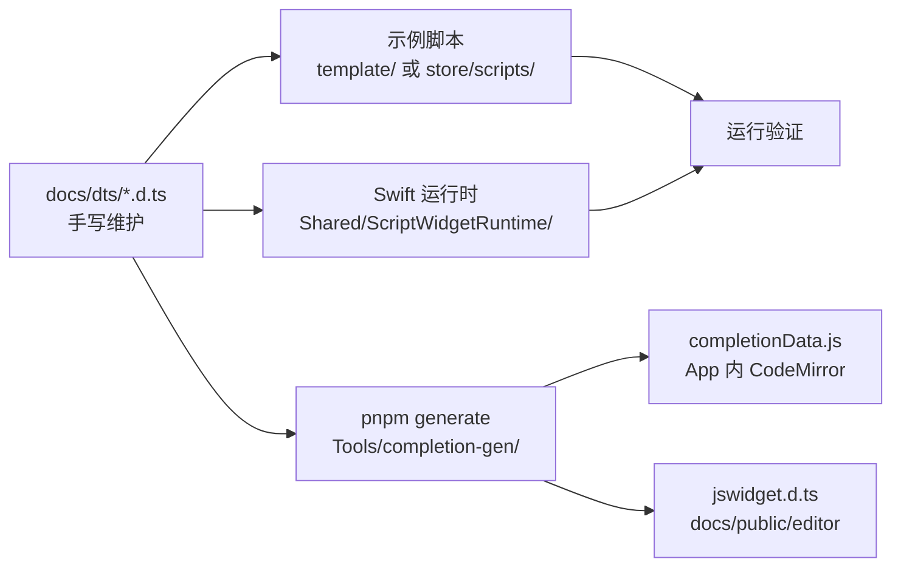

# 开发指引

> 面向**仓库贡献者**：扩展组件、API 或类型定义。应用用户文档见 [docs/](docs/)（VitePress 文档站，运行 `pnpm docs:dev` 预览）。

本文说明如何为 JSWidget **扩展组件属性、全局 API 或类型**，以及仓库内类型定义与编辑器补全的协作方式。

---

## 核心原则：合约先行（Contract-First）

**`docs/dts/` 下的 `.d.ts` 文件是唯一的手写类型源（source of truth）。**

需求应首先体现在类型定义中（例如：某组件新增 `attribute`、某 API 增加方法或参数）。随后按「示例脚本 → Swift 实现 → 生成产物 → 真机/模拟器验证」推进。



---

## 类型定义目录

| 文件 | 内容 |
|------|------|
| `docs/dts/types.d.ts` | 公共类型：`HttpParams`、`JSWidgetPadding`、`JSWidgetFont` 等 |
| `docs/dts/api.d.ts` | 全局 API：`$http`、`$device`、`$storage`、`$render` 等 |
| `docs/dts/components.d.ts` | JSX 组件：`JSWidgetCommonAttributes`、`IntrinsicElements` |

修改任一分片后，**必须**在 `Tools/completion-gen/` 下执行生成命令（见下文）。

### 公共组件属性

所有标签共享的布局/样式属性集中在 **`JSWidgetCommonAttributes`** 中定义一次，例如 `padding`、`backgroundColor`、`cornerRadius` 等。

各标签在 `IntrinsicElements` 中通过交叉类型引用：

```ts
// 仅使用公共属性
rect: JSWidgetCommonAttributes;

// 公共属性 + 标签专有属性
text: JSWidgetCommonAttributes & {
  /** 文字颜色 */
  color?: string;
};

// 覆盖公共属性中的某一字段（如 row 的 align 含 baseline）
row: Omit<JSWidgetCommonAttributes, "align"> & {
  align?: "start" | "end" | "center" | "firstBaseline" | "lastBaseline";
  spacing?: string | number | boolean;
};
```

属性上方的 `/** ... */` 注释会进入编辑器补全的说明文案，请用中文写清语义。

---

## 推荐开发流程

### 1. 在 `docs/dts/` 中定义或修改合约

- **新组件属性**：在 `components.d.ts` 的对应标签类型上增加字段；若多数标签共用，优先加到 `JSWidgetCommonAttributes`。
- **新 API**：在 `api.d.ts` 增加 `declare const` / `declare function`；若涉及新参数类型，先在 `types.d.ts` 补充类型。
- **枚举值**：使用字符串字面量联合类型，例如 `align?: "start" | "center" | "end"`，以便生成属性值补全。

### 2. 编写示例脚本

在以下位置之一新增或修改 `main.jsx`，用真实用法验证 API 设计是否合理：

- `Shared/ScriptWidgetRuntime/Resource/Script.bundle/template/` — 面向用户的模板
- `store/scripts/` — 商店示例脚本

示例应覆盖新增字段的典型用法与边界情况。

### 3. 实现 Swift 运行时

在 `Shared/ScriptWidgetRuntime/` 中实现行为，与 `.d.ts` 语义保持一致：

- 组件属性：`Widget/Component/` 下对应 Modifier / Element
- 全局 API：`Widget/API/` 下对应 `ScriptWidgetRuntime*.swift`

### 4. 生成编辑器产物

```bash
pnpm install              # 仓库根目录，首次
pnpm generate:completion  # 或 pnpm build:tools（含 jsx-compiler + completion-gen）
```

生成结果：

| 输出 | 用途 |
|------|------|
| `Editor/editorfe/src/completionData.js` | App 内嵌 CodeMirror 的标签/属性/API 补全 |
| `docs/public/editor/jswidget.d.ts` | 文档站远程 Monaco 编辑器的类型检查与提示 |

若修改了 `completionData.js` 且需在 App 内看到最新补全，需重新构建 Editor 前端（`cd Editor/editorfe && pnpm run build`）并随 iOS/macOS 目标打包。

### 5. 同步用户文档（如需要）

面向**脚本作者**的说明维护在 `docs/`（会发布到文档站，勿与本文混放）：

- `docs/components/index.md` — 组件与属性说明
- `docs/api/index.md` — 运行时 API 说明

类型变更后请酌情更新对应章节，保持与 `docs/dts/` 一致。

### 6. 验证

- 在 Xcode 中运行 `ScriptWidget` / `ScriptWidgetMac`，加载示例脚本，确认渲染与 API 行为符合预期。
- 可选：在仓库根目录执行 `pnpm docs:dev`，打开「远程编辑器」，确认 Monaco 对新类型的提示正常。

---

## 文档站（用户向）

`docs/` 为 VitePress 源目录，仅包含面向应用用户的文档。配置在 `.vitepress/config.ts`。

```bash
pnpm install    # 仓库根目录，首次
pnpm docs:dev   # 开发预览
pnpm docs:build # 生产构建，输出 .vitepress/dist
```

静态资源（含远程编辑器）位于 `docs/public/`，构建后可通过 `/editor/` 访问。

---

## 常见问题

**Q：能否直接改 `completionData.js` 或 `docs/public/editor/jswidget.d.ts`？**  
A：不要。二者均为自动生成，下次 `pnpm generate` 会被覆盖。

**Q：完整 `.d.ts` 应该改哪里？**  
A：只改 `docs/dts/` 三分片；合并后的 `docs/public/editor/jswidget.d.ts` 由 `pnpm generate` 产出。

**Q：新增 `$foo` API 后补全没有方法列表？**  
A：在 `api.d.ts` 中用带方法签名的对象类型声明，例如 `declare const $foo: { bar(): string }`。`Record<string, unknown>` 不会导出方法名。

**Q：`$system` / `$health` 等方法为空？**  
A：与 `.d.ts` 中 `Record<string, unknown>` 一致；若运行时实际有固定方法，应在 `api.d.ts` 改为显式接口后再 `pnpm generate`。

---

## 相关路径速查

| 路径 | 说明 |
|------|------|
| `docs/dts/` | 类型源（手写） |
| `Tools/completion-gen/` | 解析与生成脚本（`generate.mjs`） |
| `Editor/editorfe/src/autoCompletion.js` | CodeMirror 补全逻辑（一般无需改） |
| `Shared/ScriptWidgetRuntime/` | JSX → SwiftUI 与 JS API 实现 |
| `docs/components/index.md`、`docs/api/index.md` | 用户向文档（文档站） |
| `docs/public/editor/` | 远程 Monaco 编辑器静态页 |
| `.vitepress/` | VitePress 配置（仓库根目录） |
