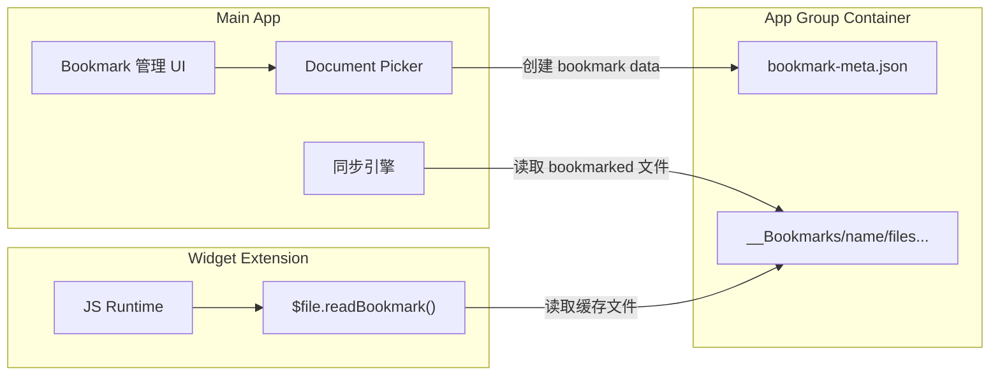

# FileBookmarks Feature Plan

## 概述

引入 FileBookmarks 功能，让脚本可以通过 bookmark 名称读取外部文件。主 App 通过 document picker 管理 bookmarks，将文件内容同步到 App Group 共享容器，Widget 从共享容器读取。

## 任务列表

- [ ] 创建 BookmarkManager.swift — bookmark 元数据管理、security-scoped bookmark 创建/解析、文件同步逻辑
- [ ] 创建 SettingsBookmarkView.swift — bookmark 管理界面（添加/删除/同步/状态展示）
- [ ] 扩展 ScriptWidgetRuntimeFile.swift — 新增 listBookmarks/readBookmark/readBookmarkJSON/listBookmarkFiles 方法
- [ ] 在 App 生命周期中集成同步触发点（进入前台、Settings 手动触发）
- [ ] 更新 docs/api.md 文档，添加 FileBookmarks 相关 API 说明

## 架构设计

由于 Widget Extension 无法 resolve 主 App 创建的 security-scoped bookmarks（bundle ID 不同），采用 **同步缓存** 架构：



## 数据存储结构

在 App Group 共享容器中：

```
group.qwertyyb.jswidget/
├── Documents/          (existing)
├── __Build/            (existing)
└── __Bookmarks/
    ├── meta.json       (bookmark 元数据: name, path, lastSync, etc.)
    ├── MyNotes/        (bookmark "MyNotes" 的同步文件)
    │   ├── note1.md
    │   └── data.json
    └── WorkData/       (bookmark "WorkData" 的同步文件)
        └── report.csv
```

`meta.json` 结构：
```json
[
  {
    "name": "MyNotes",
    "bookmarkData": "<base64 encoded security-scoped bookmark>",
    "originalPath": "/path/to/original",
    "lastSyncDate": "2026-05-14T10:00:00Z",
    "syncMode": "all",
    "fileFilter": ["*.md", "*.json"]
  }
]
```

## JS API 设计

扩展现有的 `$file` API，新增 bookmark 相关方法：

```javascript
// 列出所有 bookmarks
const bookmarks = $file.listBookmarks();
// => ["MyNotes", "WorkData"]

// 读取 bookmark 下的文件
const content = $file.readBookmark("MyNotes", "note1.md");

// 读取 bookmark 下的 JSON 文件
const data = $file.readBookmarkJSON("MyNotes", "config.json");

// 列出 bookmark 下的文件
const files = $file.listBookmarkFiles("MyNotes");
// => ["note1.md", "data.json"]
```

## 实现模块

### 1. BookmarkManager (Shared, 新文件)

- 路径: `Shared/ScriptWidgetRuntime/Common/BookmarkManager.swift`
- 职责: bookmark 元数据读写、同步逻辑、文件缓存管理
- 关键方法:
  - `addBookmark(name:, url:, fileFilter:)` — 创建 bookmark 并存储
  - `removeBookmark(name:)` — 删除 bookmark 及缓存
  - `syncBookmark(name:)` — 同步单个 bookmark 的文件到缓存
  - `syncAllBookmarks()` — 同步所有 bookmarks
  - `getCachedFilePath(bookmarkName:, relativePath:)` — 获取缓存文件路径
  - `listCachedFiles(bookmarkName:)` — 列出缓存的文件

### 2. Bookmark 管理 UI (iOS App)

- 路径: `iOS/ScriptWidget/View/SettingsBookmarkView.swift`
- 在 Settings 中新增 "File Bookmarks" section
- 功能: 添加(document picker)、重命名、删除、手动同步、查看状态

### 3. JS Runtime API 扩展

- 修改: `Shared/ScriptWidgetRuntime/Widget/API/ScriptWidgetRuntimeFile.swift`
- 新增 `listBookmarks()`, `readBookmark(_:_:)`, `readBookmarkJSON(_:_:)`, `listBookmarkFiles(_:)` 方法
- 更新 `ScriptWidgetRuntimeFileExports` protocol

### 4. 同步时机

- 主 App 进入前台时触发 `syncAllBookmarks()`
- 用户手动点击 "UPDATE" 按钮
- 添加新 bookmark 时立即首次同步
- 可选: Background App Refresh 触发

## 同步策略

- **文件过滤**: 支持配置 glob pattern（如 `*.md`, `*.json`, `*.csv`），避免同步无关大文件
- **大小限制**: 单文件上限 1MB，总空间上限可配置（默认 50MB）
- **增量同步**: 比较文件修改时间，仅同步变更文件
- **目录深度**: 默认最多 3 层递归，避免过度扫描

## 平台兼容

- macOS App 同样支持 bookmark 管理（macOS 的 security-scoped bookmarks 更成熟）
- Shared 层代码 iOS/macOS 共享，UI 层各自实现

## 注意事项

- bookmark 可能因用户移动/删除原文件夹而失效，需要 `bookmarkDataIsStale` 检测和 UI 提示
- App Group UserDefaults 有容量限制，bookmark 元数据应存储为文件而非 UserDefaults
- Widget timeline refresh 时只读取缓存，不触发同步（避免超时）
